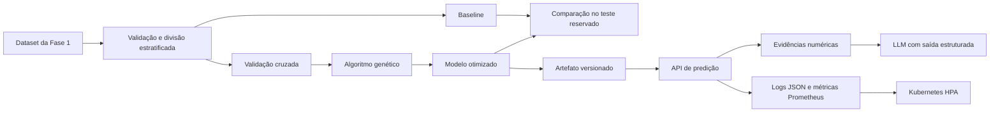

# Arquitetura

## Decisões principais

1. **Projeto independente, continuidade de dados:** a Fase 2 lê o projeto da
   Fase 1, mas não o modifica.
2. **Código em `src`:** notebooks são demonstrações; regras de negócio ficam em
   módulos testáveis.
3. **Teste reservado:** o algoritmo genético só usa validação cruzada no treino.
4. **Recall prioritário:** fitness de 65% recall e 35% F1.
5. **LLM posterior ao modelo:** a LLM comunica a saída e não calcula diagnóstico.
6. **API stateless:** artefato carregado por réplica; nenhuma sessão local é
   necessária, permitindo escalabilidade horizontal.

## Componentes

| Componente | Responsabilidade |
|---|---|
| `data.py` | Localizar, validar e dividir o dataset |
| `models.py` | Construir modelos e calcular métricas |
| `ga.py` | Operadores e ciclo evolutivo |
| `optimization.py` | Fitness por CV e experimentos |
| `explainability.py` | Evidências factuais da previsão |
| `llm.py` | Prompt, schema e providers de explicação |
| `api.py` | Health, predição e métricas |
| `observability.py` | Logs estruturados |

## Escalabilidade

O diretório `deploy/k8s` contém Deployment, Service e HPA. O HPA mantém de 2 a
10 réplicas e escala quando a utilização média de CPU ultrapassa 65%. A execução
em nuvem não é necessária para demonstrar a configuração.

